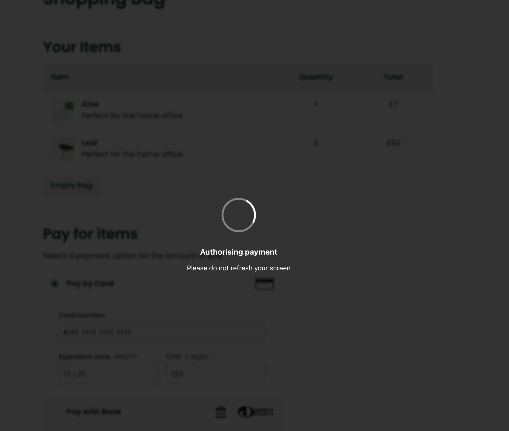

import Tabs from "@theme/Tabs";
import TabItem from "@theme/TabItem";

Any merchant using Gr4vy Embed will automatically benefit from **Universal 3-D
Secure** once it has been [set up](setup) for a payment service.



## Buyers & Billing Details

To optimize 3-D Secure it is highly recommended to provide a buyer with billing
details attached to Gr4vy Embed.

A buyer can be set up via our [`POST /buyers`](../reference#operation/add-buyer)
API. The buyer can then be attached to Gr4vy Embed by using the `buyerId` or
`buyerExternalIdentifier` property. The buyer's name, email address, and billing
address will be used to help reduce buyers being asked to complete a 3-D Secure
challenge.

<Tabs
  groupId="language"
  defaultValue="react"
  values={[
    { label: 'React', value: 'react', },
    { label: 'Node', value: 'node', },
  ]}
>
  <TabItem value="react">

```js {6}
<Gr4vyEmbed
  gr4vyId="acme"
  amount={1299}
  curency="USD"
  country="US"
  buyerExternalIdentifier="user-1234"
  ...
/>
```

  </TabItem>

  <TabItem value="node">

```js {6}
gr4vy.setup({
   gr4vyId: "acme",
   amount: 1299,
   currency: "USD",
   country: "US",
   buyerExternalIdentifier: "user-1234",
   ...
});
```

  </TabItem>

</Tabs>

Gr4vy will use these billing details and use them to initialize 3-D Secure.

## Features

For every transaction Gr4vy will handle the following steps.

1. Detect if the selected payment service for this transaction has 3-D Secure
   enabled
1. Detect if the card used in the transaction is enrolled for 3-D Secure
1. Handle the seemless frictionless 3-D Secure flow including the device finger
   printing
1. Handle the 3-D Secure challenge flow, where a buyer is directed in-page to
   their bank to approve the transaction

## Usage

All you need to do to use 3-D Secure in Gr4vy Embed is to [set up](setup) 3-D
Secure on any of your enabled payment services. Once configured, Gr4vy Embed
will handle all the user interaction.
