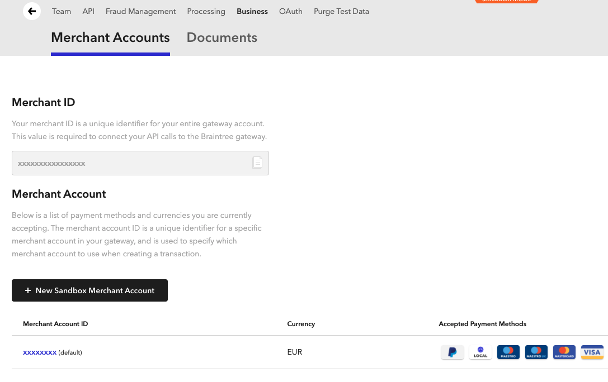
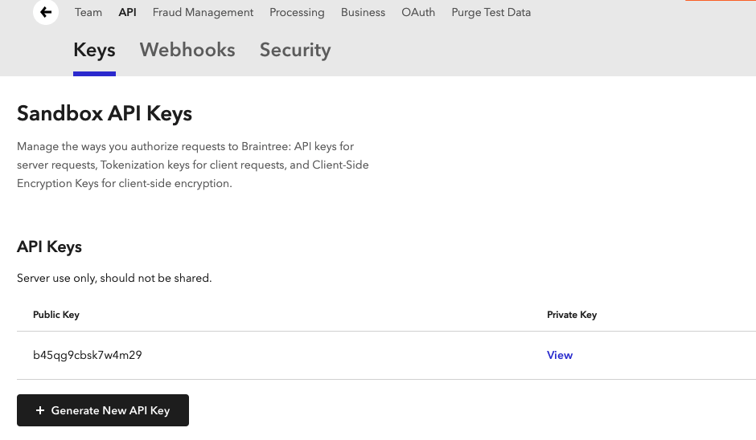

## Sign-up

Braintree provides a self-service sign-up for a sandbox account.  To sign-up for an account visit the [sign-up page](https://www.braintreepayments.com/gb/sandbox) and fill in the details.

## Credentials

When setting up Braintree in the Gr4vy Dashboard, you will need to configure the following credentials, which are obtained from Braintree:

### Merchant ID

The Braintree Merchant ID can be found in the Braintree Admin Portal under the `Settings` -> `Business` -> `Merchant Accounts` tab.

### Merchant Account ID

The Braintree Merchant Account ID can be found underneath the Merchant ID in the Braintree Admin Portal under the `Settings` -> `Business` -> `Merchant Accounts` tab.  See [Merchant ID](#merchant-id).

### Public key

The Braintree Public Key can be found in the Braintree Admin Portal under the `Settings` -> `API` -> `Keys` tab.

### Private key

The Braintree Private Key can be found in the Braintree Admin Portal under the `Settings` -> `API` -> `Keys` tab. See [Public key](#public-key).

### Mode

The mode is used to configure if the credentials are for usage with the `Live` or `Sandbox` APIs.