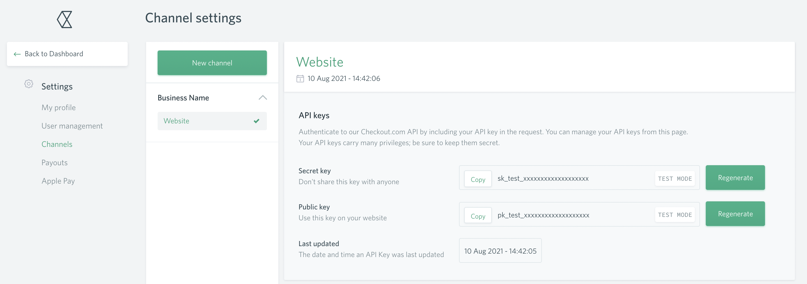

## Sign-up
Checkout.com provides a self-service sign-up for a sandbox account.  To sign-up for an account simply visit the [sign-up page](https://www.checkout.com/get-test-account) and fill in the details.

## Credentials
When setting up Checkout.com in the Gr4vy Dashboard, you will need to configure the following credentials, which are obtained from Checkout.com:

### Public Key

The Checkout.com Public key is obtained from the Checkout.com Admin Portal under the `Settings` -> `Channels` heading.

### Secret Key

The Checkout.com Secret key is obtained from the Checkout.com Admin Portal under the `Settings` -> `Channels` heading. See [Public Key](#public-key).

### Mode
 
The mode is used to configure if the credentials are for usage with the `Live` or `Sandbox` APIs.