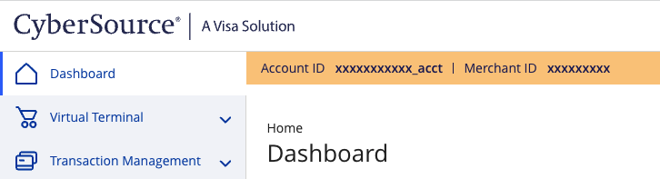
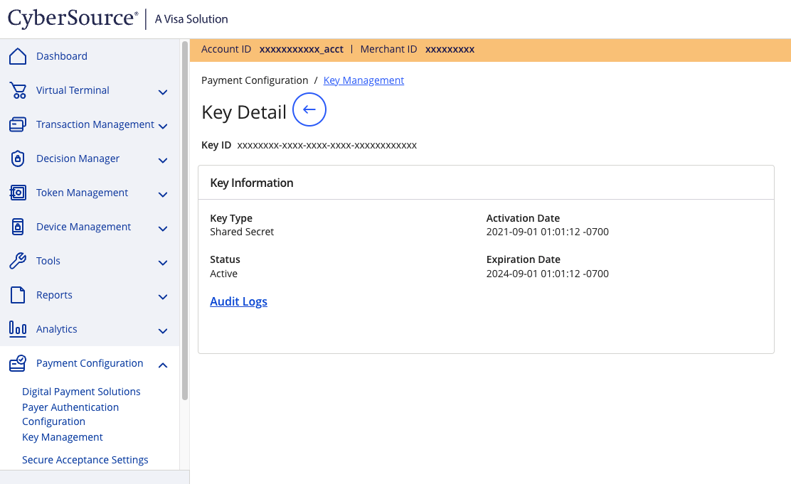

## Sign-up
To sign-up for a CyberSource account you will need to request a [sandbox account](https://developer.cybersource.com/hello-world/sandbox.html), this can take 1-2 days.

## Credentials
When setting up CyberSource in the Gr4vy Dashboard, you will need to configure the following credentials, which are obtained from CyberSource Business Center:

### Merchant Id

This is the CyberSource-assigned Merchant ID for your account.  You can see this in the CyberSource Business Center

### Key ID

The CyberSource Secret Key and Key ID can be viewed/created in the CyberSource Business Center at `Payment Configuration` -> `Key Management` -> `<your key>` section.

### Secret key

The CyberSource Secret Key can be viewed/created in the CyberSource Business Center at `Payment Configuration` -> `Key Management` -> `<your key>` section.  See [Key ID](#key-id).

### Mode
 
The mode is used to configure if the credentials are for usage with the `Live` or `Sandbox` APIs.

## Features

Some CyberSource features will need to be enabled by their support team to be used/tested through Gr4vy.  For example:

* 3D secure - will need to be activated on your merchant id, using Gr4vy's 'external MPI'
* Tokenisation - will need to be activated on your merchant id, ensuring support for both `Instrument Identifiers` and `Payment Instruments` is added.

