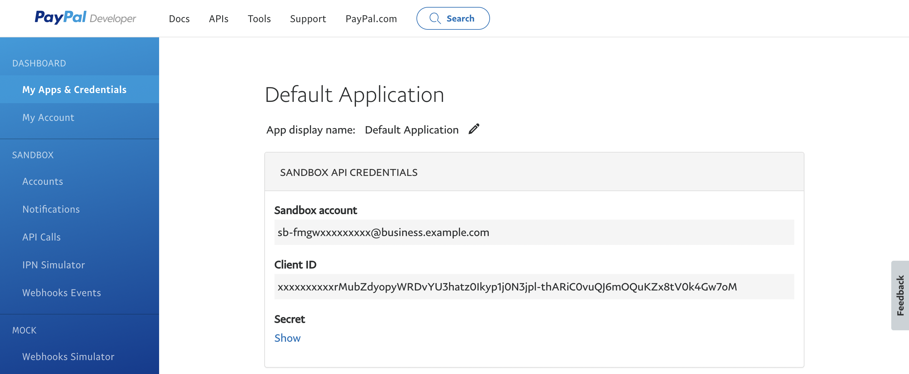

## Sign-up
PayPal provides a self-service sign-up for a sandbox account.  To sign-up for an account simply visit the [sign-up page](https://www.paypal.com/uk/webapps/mpp/account-selection) and fill in the details, ensuring to choose `Business Account` when prompted.

## Credentials
When setting up PayPal in the Gr4vy Dashboard, you will need to configure the following credentials, which are obtained from PayPal:

### Client ID

The PayPal Client ID can be found in the PayPal Admin Portal under the `My Apps & Credentials` -> `REST API Apps` -> `Your App` section.

### Client Secret

The PayPal Client Secret can also be found in the PayPal Admin Portal under the `My Apps & Credentials` -> `REST API Apps` -> `Your App` section. See [Client ID](#client-id).

### Mode
 
The mode is used to configure if the credentials are for usage with the `Live` or `Sandbox` APIs.