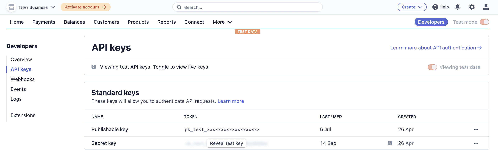

## Sign-up
Stripe provides a self-service sign-up for a sandbox account.  To sign-up for an account simply visit the [sign-up page](https://dashboard.stripe.com/register) and fill in the details.

## Credentials
When setting up Stripe in the Gr4vy Dashboard, you will need to configure the following credentials, which are obtained from Stripe:

### Secret key

The Stripe Secret key can be found in the Stripe Admin Portal under the `Developers` -> `API Keys` section.

### Mode
 
The mode is used to configure if the credentials are for usage with the `Live` or `Sandbox` APIs.