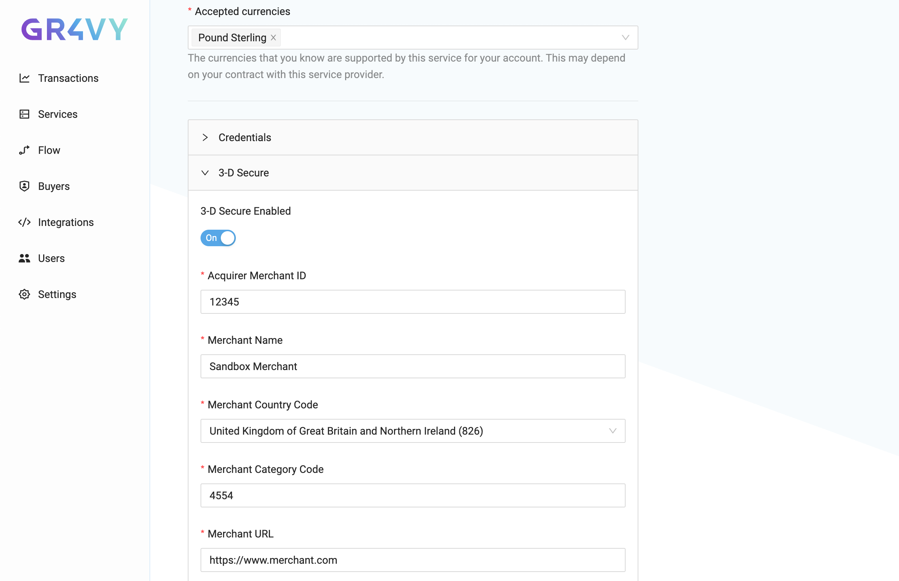

To set up 3-D Secure for a payment service, head over to your Gr4vy dashboard
and switch to the **services** tab. Then select one of your active payment
services to edit and scroll down to the **3-D Secure** section.

:::info 3-D Secure with 3rd-party MPI

Configuring 3-D Secure is only required when using 3-D Secure via
[Gr4vy Embed](embed) or as a [hosted option via the API](hosted). Configuration
is not required when you intend to use your own MPI/3-D Secure Server.

:::

### Configuration

In this section you will have the option to configure 3-D Secure for this
payment service by providing a few details.

| Field                      | Description                                                                                                                           |
| -------------------------- | ------------------------------------------------------------------------------------------------------------------------------------- |
| **Acquirer Merchant ID**   | Your merchant ID as registered by the acquirer used by this payment service.                                                          |
| **Merchant Name**          | Your merchant name. This will be sent on to Gr4vy's 3-D Secure provider.                                                              |
| **Merchant Country Code**  | ISO 3166-1 numeric three-digit country code for this merchant account.                                                                |
| **Merchant Category Code** | The merchant category code or `mcc` for the merchant account. This describes type of business, product or service offered.            |
| **Merchant URL**           | The URL on which the payments are processed.                                                                                          |
| **Supported Card Schemes** | A list of card schemes that this payment service can process. 3-D Secure will only be used for cards that match any of these schemes. |
| **Scheme Acquirer BIN**    | The acquirer BIN for each of the supported card schemes. One needs to be provided for every one of the supported card schemes.        |

:::caution Where do I find these details?

You can find most of these identifiers either in your payment service's
dashboard or through their support channels. Please see the details for each of
the **connectors** for more information.
