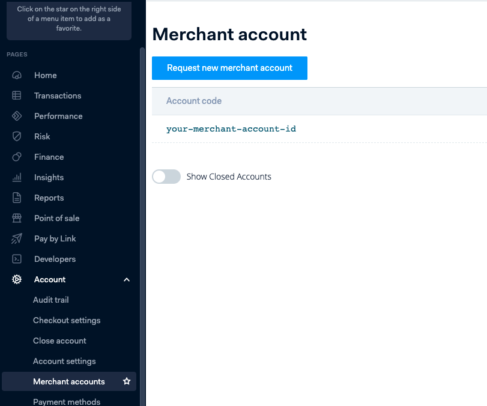

## Sign-up

Adyen provides a self-service sign-up for a sandbox account.  To sign-up for an account visit the [sign-up page](https://www.adyen.com/signup) and fill in the details.

## Credentials

When setting up Adyen in the Gr4vy Dashboard, you will need to configure the following credentials, which are obtained from Adyen:

### API Key

The Adyen API key is obtained from the Adyen Admin Portal under the `Developers` -> `API Credentials` heading.

### Merchant Account

The Adyen Merchant Account can be found in the Adyen Admin Portal under the `Account` -> `Merchant accounts` heading.

### Live endpoint prefix (conditional)

The live endpoint prefix is required for live Adyen transactions.  The prefix is a combination of the random and company name from the live endpoint.

For example, if your live URL is `https://1797a841fbb37ca7-AdyenDemo-checkout-live.adyenpayments.com/checkout/v53/payments` then the live URL prefix would be `1797a841fbb37ca7-AdyenDemo`.

See [Live URL prefix](https://docs.adyen.com/development-resources/live-endpoints#live-url-prefix) for more details.

### Mode

The mode is used to configure if the credentials are for usage with the `Live` or `Sandbox` APIs.