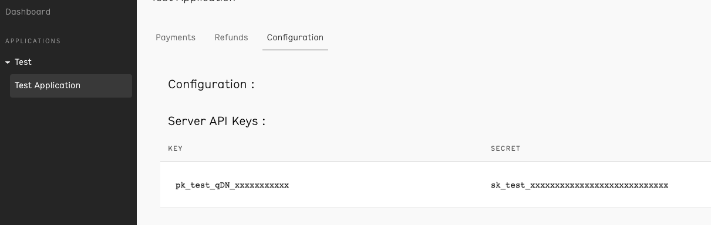

## Sign-up

Banked provides a self-service sign-up for a sandbox account.  To sign-up for an account visit the [sign-up page](https://console.banked.com/users/sign_up) and fill in the details.

## Credentials

When setting up Banked in the Gr4vy Dashboard, you will need to configure the following credentials, which are obtained from Banked:

### Client ID

The Banked Client ID is obtained from the Banked Admin Portal under the `Applications` -> `<Your Application>` -> `Configuration` tab.

### Client secret

  The Banked Client secret is obtained from the same tab as the [Client ID](#client-id).

### Payee name

The name of the Payee, for example the person or company the payment is to be made to.

:::caution Payee Details

By default you are only permitted to create a payment session with payee details that match an account linked to the Banked console. In the test environment you will have a fake bank account created automatically when signing up to the console. Unless you connect additional sandbox accounts, you must use the following payee details:

* `account_number`: `12345678`
* `sort_code`: `010203`

:::

### Payee account number

The account number of the Payee, for example the person or company the payment is to be made to. See [Payee name](#payee-name) for more details.

### Payee sort code

The sort code of the Payee, for example the person or company the payment is to be made to. See [Payee name](#payee-name) for more details.

### Mode

The mode is used to configure if the credentials are for usage with the `Live` or `Sandbox` APIs.
