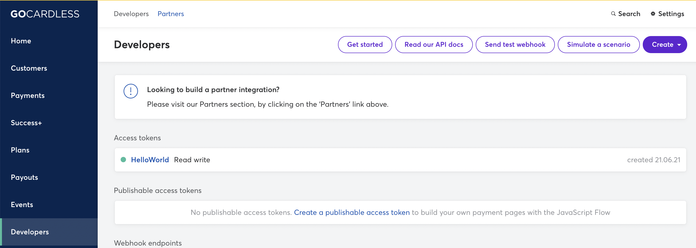

## Sign-up
GoCardless provides a self-service sign-up for a sandbox account.  To sign-up for an account visit the [sign-up page](https://manage-sandbox.gocardless.com/signup) and fill in the details.

## Credentials
When setting up GoCardless in the Gr4vy Dashboard, you will need to configure the following credentials, which are obtained from GoCardless:

### Access Token

The GoCardless Access Token can be found in the GoCardless Admin Portal under the `Developers` -> `Access Tokens` section.

If there are no access tokens in the list you will need to create a new Access Token by clicking the `Create` button and selecting `Access Token`.

### Mode

The mode is used to configure if the credentials are for usage with the `Live` or `Sandbox` APIs.