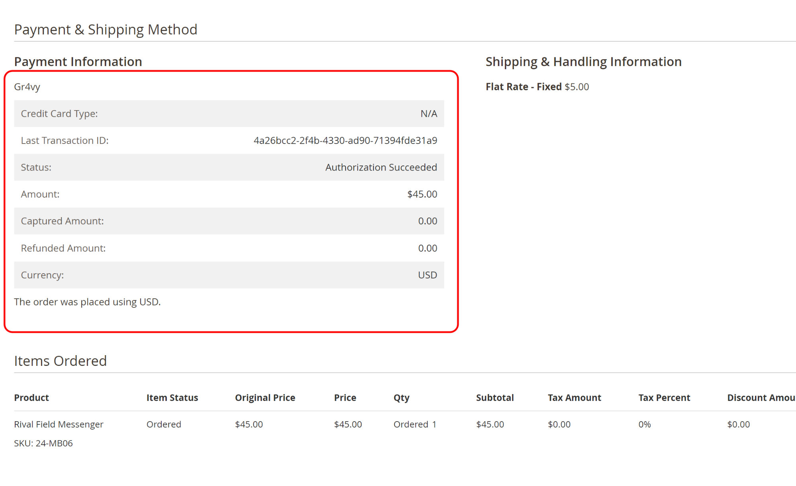
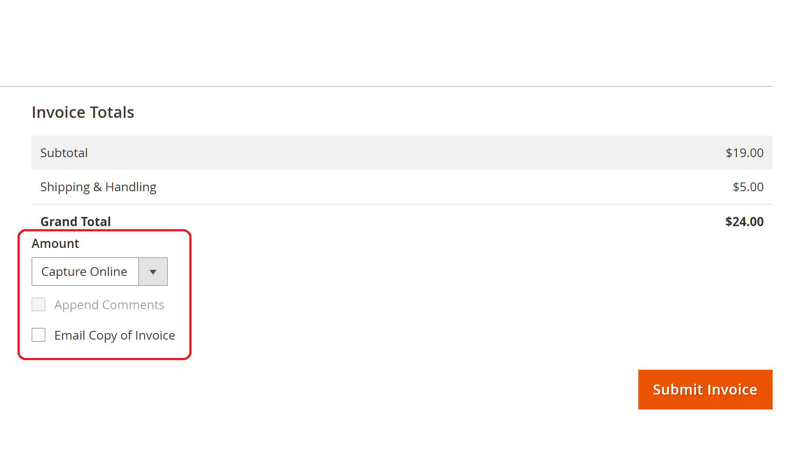
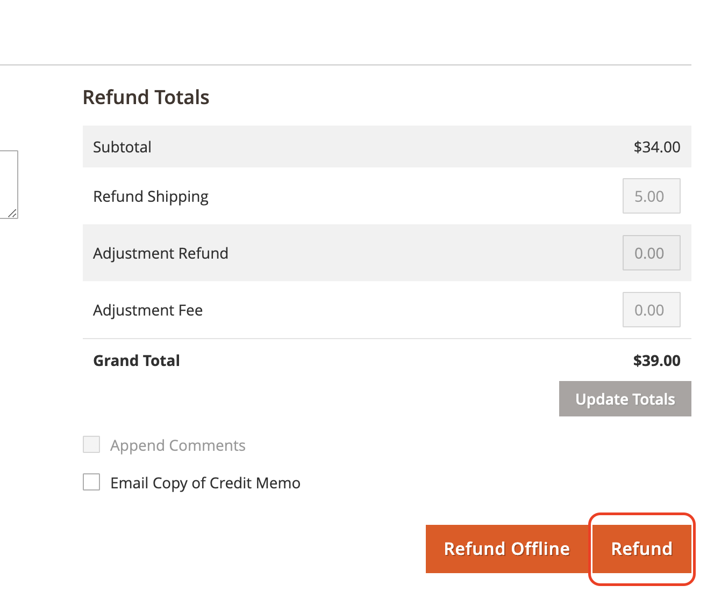
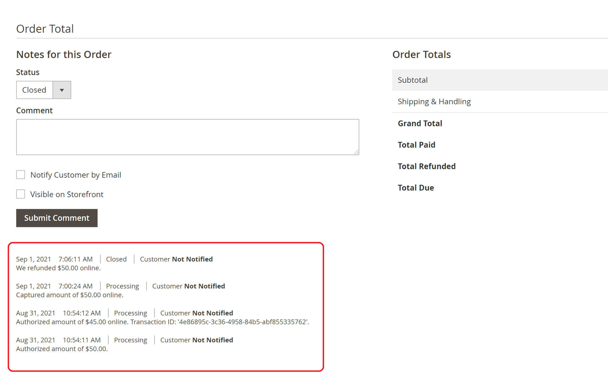

## Payment information

Gr4vy transaction information can be found in the order edit page in the Magento admin by going to:

**Sales > Orders > [Select Order]**

Information such as transaction id, transaction status, amount of transaction, currency etc are presented in the **Payment Information** section:

## Capture payment online

The admin user can capture an Authorized transaction by creating a new invoice for the order.

To do this, go to:

**Sales > Orders > [Select Order]** and click the **Invoice link**

Select the **Capture Online** option under the **Amount** heading.

Finally, click the **[Submit Invoice]** button to capture the payment.

:::info Capture Online

Capture Online is not available if the Gr4vy **Payment Action** configuration is set to **Authorize and Capture**

:::

## Refund payment

To perform an online refund, go to the edit page of the invoice you want to refund, via either of these routes:

**Sales > Invoices > [Select Invoice]** and click on the **[Credit Memo]** button

**Sales >  Orders > [Select Order]**, click on the **Invoices** tab, **[Select Invoice]** and finally, click on the **[Credit Memo]** button

On the refund page, there are two action buttons available:

1. **[Refund Offline]** - This option won’t trigger a refund transaction in Gr4vy, only in Magento

2. **[Refund]** - This option will instruct Gr4vy to refund the captured transaction amount to the customer’s account

## Order comments history

Transaction information is appended to the order comments history section within the order view page whenever a customer submits a transaction, or when an admin user performs a payment capture or a transaction refund request.

There are four types of transactional information, see examples below:

1. Authorization message from Magento
2. Authorization message from Gr4vy, with transaction ID
3. Capture message from Gr4vy
4. Refund message from Gr4vy

