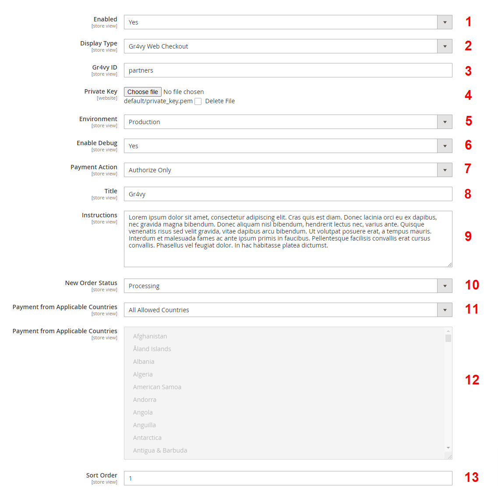

Within your Magento admin, you can access the Gr4vy module configuration by going to:

**Stores > Settings > Configuration > Sales > Payment Methods > Gr4vy**

1. Enable or disable the Gr4vy payment method

2. Specify how the Gr4vy payment method appears on frontend

3. Add your Gr4vy ID you received after your registration with Gr4vy

4. Click on the “Choose File” button and select the private key obtained from Gr4vy account dashboard

5. Choose the current appropriate environment setting

6. Enable or disable debug. The output can be found in `<webroot_dir>/var/log/gr4vy_debug.log`

7. Select the payment action type

8. Specify a title for the Gr4vy Payment method on the checkout page and the order view page

9. Add a description below the Gr4vy payment method title on the checkout page (or leave it blank)

10. Specify the status of new orders processed via Gr4vy

11. Limit the Gr4vy payment method by countries

12. Limit the Gr4vy payment method by countries

13. Sort the order of the Gr4vy payment method on the checkout page