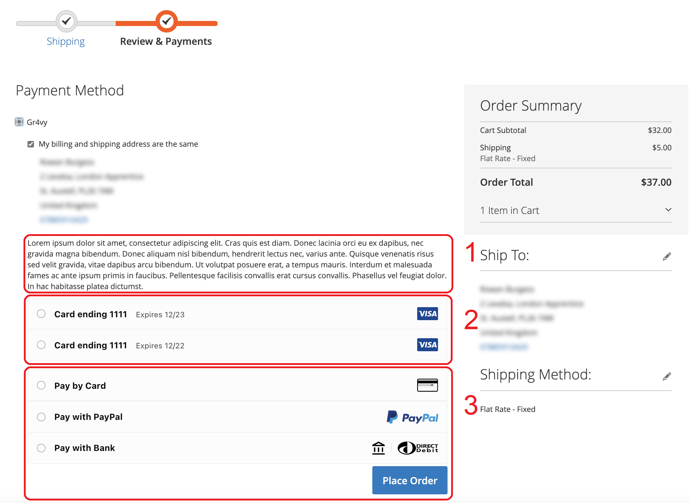
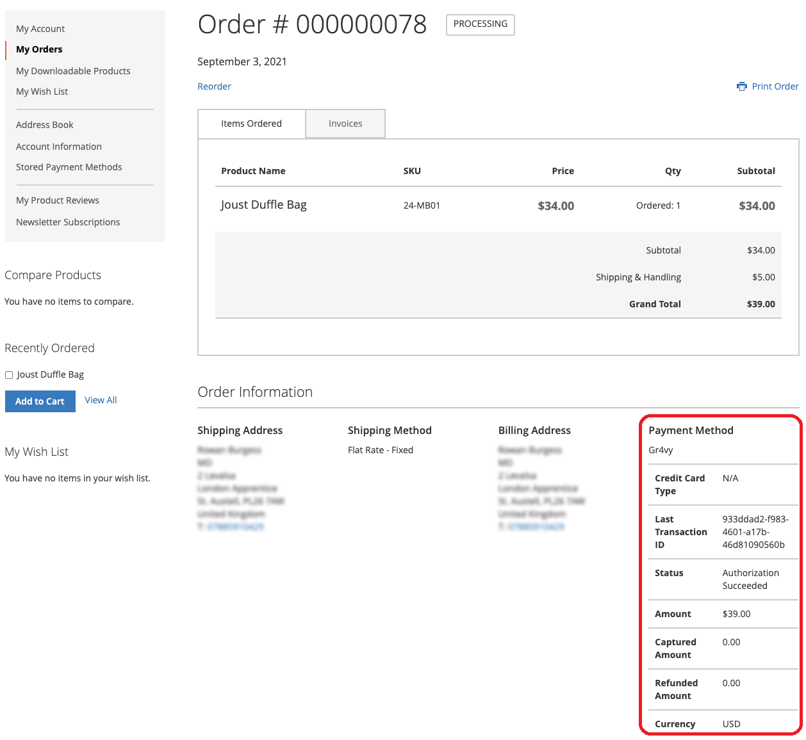

## Checkout page

Once the Gr4vy module is installed and configured, you should see the Gr4vy payment method listed in the Payment Method section on the checkout page.

1. The description will change depending on the configuration value specified in the admin

2. Card details the customer opted to save from previous transactions

3. Available payment options as configured in your Gr4vy account dashboard

## Customer account dashboard

Logged in customers will see Gr4vy payment information within the order details page:

